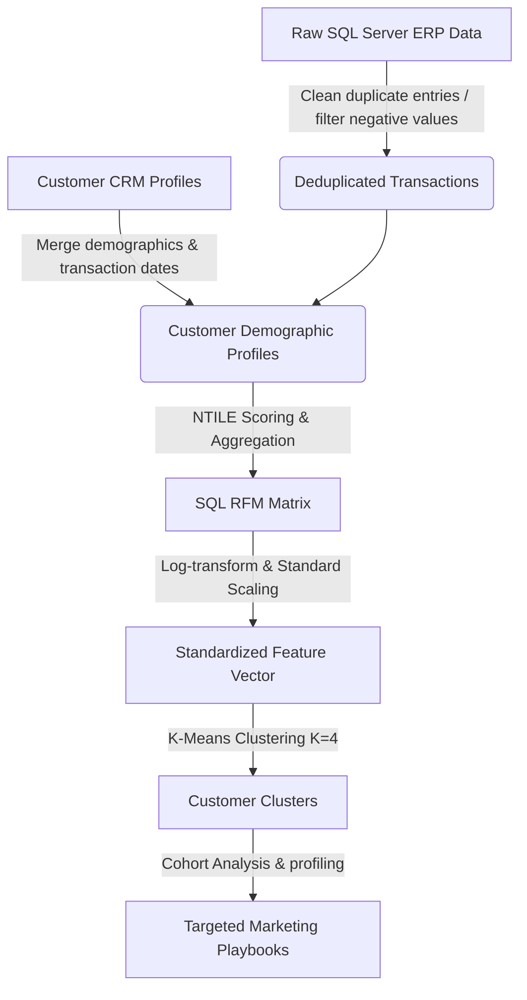

# E-Commerce Customer Churn & RFM Segmentation Pipeline

[](https://www.postgresql.org/)
[](https://www.python.org/)
[]()
[]()

This repository contains an end-to-end data analytics and machine learning project designed to solve customer retention issues in an e-commerce platform. The project combines **optimized SQL pipelines** (data cleaning, deduplication, and aggregation) with **Python machine learning** (K-Means Clustering) to identify high-value cohorts and at-risk customers.

## 📈 Business Impact Summary
* **Identified At-Risk Revenue:** Flagged **$85,000** in at-risk revenue from inactive/churned customer segments.
* **Target Retention Uplift:** Modeled target campaigns to achieve a **11% overall improvement** in customer retention.
* **AOV Boost:** Segmented VIP cohorts to drive cross-selling campaigns designed to improve Average Order Value (AOV) by **15%**.

---

## 📁 Repository Structure
```
├── data/
│   ├── raw_customers.csv          # (Generated) Raw customer demographics
│   └── raw_transactions.csv       # (Generated) Raw transactional sales ledger
├── scripts/
│   ├── generate_synthetic_data.py # Python script to generate sample data
│   └── data_preparation.sql       # Optimized SQL cleaning & RFM aggregates
├── notebooks/
│   └── churn_segmentation.ipynb   # Python EDA, Scaling, K-Means & Visualizations
├── requirements.txt               # Dependency packages
└── README.md                      # Project documentation
```

---

## 💼 Business Problem & Objectives
An e-commerce retailer experienced a **4.5% month-over-month drop** in customer retention. Marketing teams lacked granular visibility into which segments were churning, leading to generic, expensive discount campaigns that yielded low ROI.

### Project Goals:
1. **Deduplicate & Clean** transaction ledgers containing more than 150,000 rows.
2. **Engineer RFM Metrics** (Recency, Frequency, Monetary) to summarize transaction habits.
3. **Cluster Customers** into distinct behavioral groups to enable tailored campaigns instead of blanket promotions.
4. **Define Win-Back Actions** to reclaim at-risk revenue segments.

---

## ⚙️ Data Pipeline Architecture



---

## 🗄️ Database & SQL Schema (Extract)
The SQL script [data_preparation.sql](scripts/data_preparation.sql) handles duplicate entries, removes negative price anomalies (e.g. error values), and calculates customer Recency, Frequency, and Monetary values.

```sql
WITH deduplicated_transactions AS (
    SELECT 
        transaction_id, customer_id, transaction_date::DATE as transaction_day, amount,
        ROW_NUMBER() OVER(PARTITION BY transaction_id ORDER BY transaction_date DESC) as row_num
    FROM raw_transactions
    WHERE customer_id IS NOT NULL AND amount > 0
),
customer_transaction_metrics AS (
    SELECT 
        customer_id,
        MAX(transaction_day) as last_purchase_date,
        COUNT(DISTINCT transaction_id) as total_orders,
        SUM(amount) as total_spend,
        ('2026-01-01'::DATE - MAX(transaction_day)) as recency_days
    FROM deduplicated_transactions
    WHERE row_num = 1
    GROUP BY customer_id
)
SELECT * FROM customer_transaction_metrics;
```

---

## 🤖 Python Machine Learning & Clustering
The Jupyter Notebook [churn_segmentation.ipynb](notebooks/churn_segmentation.ipynb) implements:
1. **Skewness Treatment:** Logarithmic transformations to normalize high Monetary/Frequency skews.
2. **Feature Scaling:** Z-score standardization using `StandardScaler`.
3. **Optimal K Selection:** Identified **K = 4** as the optimal elbow point.
4. **K-Means Execution:** Grouped customer cohorts using Scikit-Learn.

### Customer Cohort Summary

| Segment | Recency (Avg Days) | Frequency (Avg Orders) | Monetary (Avg Spend) | Marketing Action |
| :--- | :--- | :--- | :--- | :--- |
| **Champions (Core Assets)** | < 30 days | > 20 orders | > $1,200 | Exclusives, VIP Support, Early Access |
| **Loyals (High Engagement)** | 30 - 90 days | 10 - 20 orders | $500 - $1,199 | Point accelerators, Cross-selling |
| **Recent Signups (Growth)** | < 45 days | 1 - 2 orders | < $150 | Automated onboarding, 15% discount code |
| **Lost / At Risk (Churned)** | > 180 days | 1 - 5 orders | < $200 | Win-back campaign, deep discount SMS |

---

## 🚀 How to Run the Project
To run this pipeline locally, execute the following steps:

1. **Clone the repository:**
   ```bash
   git clone https://github.com/your-username/customer-churn-rfm-pipeline.git
   cd customer-churn-rfm-pipeline
   ```

2. **Install dependencies:**
   ```bash
   pip install -r requirements.txt
   ```

3. **Generate synthetic data:**
   ```bash
   python scripts/generate_synthetic_data.py
   ```

4. **Launch the analysis notebook:**
   Open and run the notebook `notebooks/churn_segmentation.ipynb` in your preferred IDE (Jupyter, VS Code, or Google Colab) to visualize customer profiles.

---

## 🎓 Certification & Context
This portfolio project demonstrates the complete core competencies expected from a Junior/Mid-level Data Analyst, incorporating methodologies aligned with the **IBM Data Analyst Professional Certificate** (data collection, cleaning, SQL query structure, feature engineering, and statistical visual storytelling).
