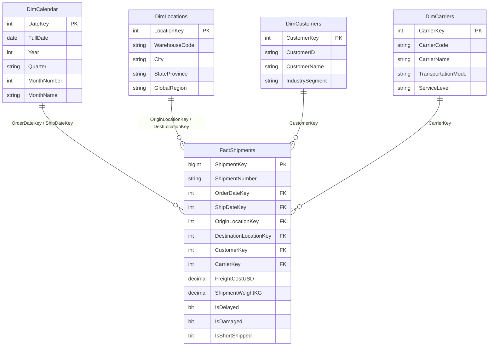

# Global Supply Chain & Logistics KPI Dashboard (Power BI)

[](https://www.microsoft.com/en-us/sql-server)
[](https://powerbi.microsoft.com/)
[]()
[]()

This repository showcases a Business Intelligence (BI) portfolio project focused on consolidating **14 regional logistics data silos** into a unified, high-performance **Star Schema** database model. It includes SQL DDL schemas, advanced DAX metrics, and dashboard architecture documentation designed to resolve freight delays and track On-Time In-Full (OTIF) service levels.

## 📈 Business Impact Summary
* **OTIF KPI Setup:** Modeled dynamic OTIF target measures allowing managers to spot and address carrier bottlenecks.
* **Cost Efficiency:** Created time-intelligence rolling spend metrics to spot regional carrier overspending.
* **Silo Merging:** Combined 14 separate regional shipping tables into a unified transactional fact table.

---

## 📁 Repository Structure
```
├── data/
│   └── sample_logistics_data.csv   # Representative freight telemetry log data
├── database/
│   └── star_schema_setup.sql       # Optimized SQL DDL for Dimensions and Fact tables
├── dax/
│   └── measures.dax                # Catalog of commented Power BI DAX formulas
└── README.md                       # Project documentation
```

---

## 💼 Business Problem & Objectives
A global manufacturer distributed shipments across multiple regional freight carriers, storing telemetry logs in siloed regional tables. Executives lacked a single version of truth, leading to:
1. Regular product stockouts due to unaccounted transit bottlenecks.
2. Inability to identify underperforming shipping carriers.
3. Lack of rolling trend reports on multi-million dollar freight spend.

### Project Goals:
1. **Design a Star Schema** in SQL Server to support rapid analytical slicing.
2. **Implement Core Logistics KPIs** in DAX, specifically On-Time In-Full (OTIF) ratio.
3. **Build Dynamic Carrier Rankings** to evaluate carrier SLA compliance.

---

## 🗄️ Database Architecture (Star Schema)

The database design splits information into descriptive Dimension tables and a central transactional Fact table to minimize join paths and improve load speeds inside Power BI:



---

## 📊 Business Intelligence Metrics (DAX Extract)
The [dax/measures.dax](dax/measures.dax) file contains advanced DAX calculations. Below is the calculation logic for the core industry metric, **OTIF % (On-Time In-Full)**:

```dax
OTIF % = 
VAR TotalDelivered = 
    CALCULATE(
        [Total Shipments],
        NOT(ISBLANK(FactShipments[ActualDeliveryDateKey]))
    )
VAR OtifCount = 
    CALCULATE(
        [Total Shipments],
        NOT(ISBLANK(FactShipments[ActualDeliveryDateKey])),
        FactShipments[IsDelayed] = 0,
        FactShipments[IsShortShipped] = 0,
        FactShipments[IsDamaged] = 0
    )
RETURN
    DIVIDE(OtifCount, TotalDelivered, 0)
```

---

## 📊 Dashboard Visual Recommendations
For building the Power BI dashboard, the model supports:
1. **Executive Scorecard:** Multi-row KPI card tracking `Total Spend`, `Total Shipments`, and `OTIF %`.
2. **Carrier Performance Matrix:** A table visual displaying carrier name, `Total Shipments`, `OTIF %`, and `Carrier OTIF Rank`.
3. **Transit Time Trends:** A line chart showing `Rolling 30D Spend` compared against the current date filter context.

---

## 🎓 Certification & Context
This portfolio project demonstrates complete competencies in data modeling, star schema formulation, and relational database modeling expected of a Business Intelligence Analyst / Developer. The architecture and formulas are aligned with practices taught in the **IBM Data Analyst Professional Certificate**.
